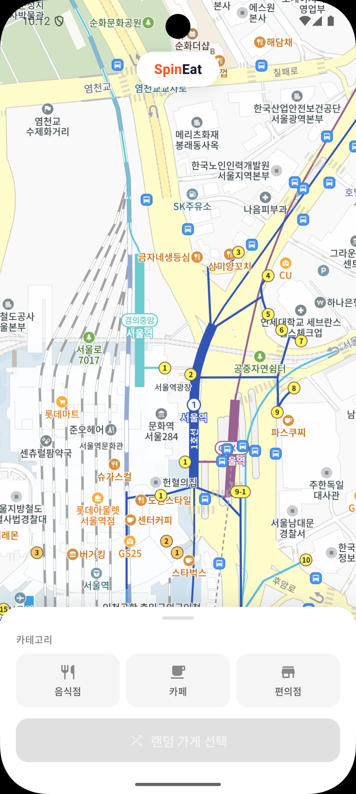
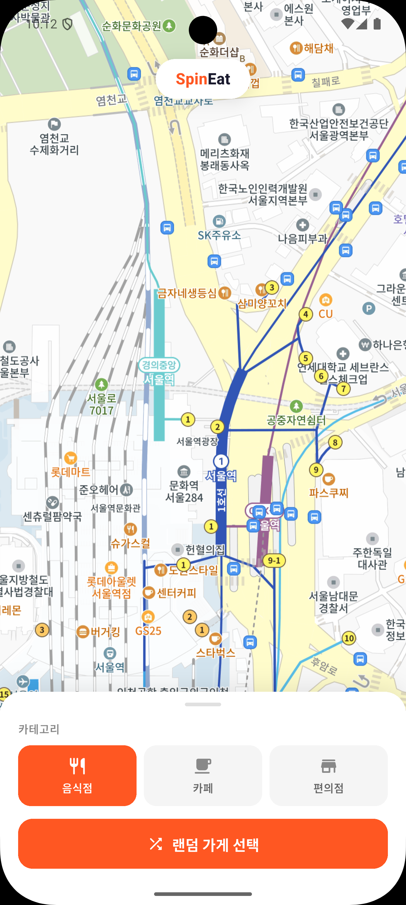
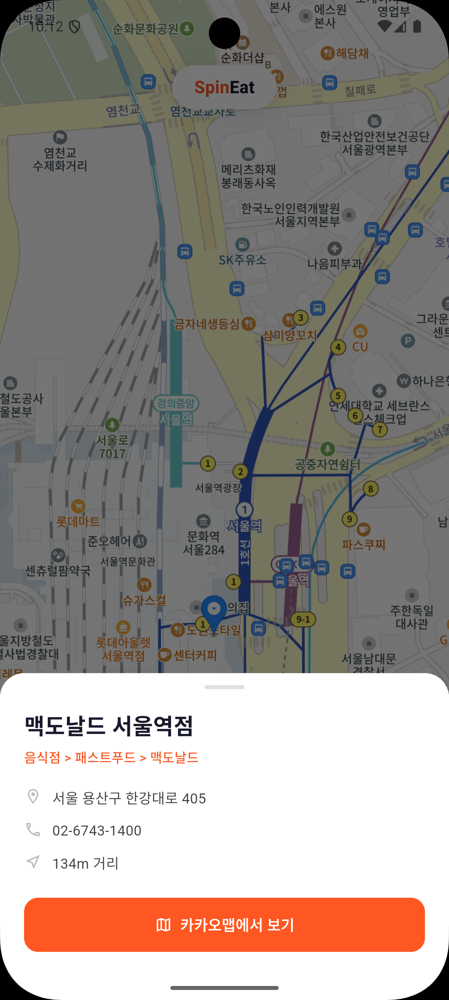

# SpinEat

> 주변 음식점을 랜덤으로 추천해주는 지도 기반 Flutter 앱

---

## 소개

"오늘 뭐 먹지?"를 해결해주는 앱입니다.  
현재 위치를 기반으로 주변 음식점 · 카페 · 편의점 중 하나를 랜덤으로 골라 지도에 핀을 꽂아줍니다.

## 주요 기능

- **현재 위치 자동 감지** — 앱 실행 시 GPS로 내 위치를 파악
- **카테고리 선택** — 음식점 / 카페 / 편의점 중 선택
- **랜덤 추천** — 주변 가게 중 하나를 무작위로 선택
- **지도 핀** — 선택된 가게를 카카오맵 위에 마커로 표시
- **가게 상세 정보** — 이름, 주소, 전화번호, 거리 확인
- **카카오맵 연동** — 앱에서 바로 카카오맵으로 이동

## 스크린샷

<p align="center">
  
  &nbsp;&nbsp;
  
  &nbsp;&nbsp;
  
</p>
<p align="center">
  <sub>홈 화면 &nbsp;&nbsp;&nbsp;&nbsp;&nbsp;&nbsp;&nbsp;&nbsp;&nbsp;&nbsp;&nbsp;&nbsp;&nbsp;&nbsp; 카테고리 선택 &nbsp;&nbsp;&nbsp;&nbsp;&nbsp;&nbsp;&nbsp;&nbsp;&nbsp;&nbsp;&nbsp; 추천 결과</sub>
</p>

## 기술 스택

| 분류 | 사용 기술 |
|---|---|
| Framework | Flutter 3.x |
| 상태관리 | flutter_bloc |
| 지도 | kakao_map_plugin |
| 위치 | geolocator |
| API 통신 | dio |
| URL 실행 | url_launcher |

## 아키텍처

```
lib/
├── core/
│   ├── config/          # API 키 등 앱 설정
│   └── constants/       # 카카오 카테고리 코드
├── data/
│   └── repositories/    # 위치·장소 데이터 레이어
└── presentation/
    ├── blocs/           # BLoC 상태관리 (location, place)
    └── screens/         # UI 화면
```

## 시작하기

### 1. 의존성 설치

```bash
flutter pub get
```

### 2. 카카오 API 키 설정

[카카오 개발자 콘솔](https://developers.kakao.com)에서 앱을 등록한 후, 아래와 같이 키를 환경변수로 주입합니다.

### 3. 실행

```bash
flutter run \
  --dart-define=KAKAO_NATIVE_KEY=네이티브키 \
  --dart-define=KAKAO_REST_KEY=REST키 \
  --dart-define=KAKAO_JS_KEY=JS키
```

## 권한 설정

위치 권한이 필요합니다.

**Android** — `AndroidManifest.xml`
```xml
<uses-permission android:name="android.permission.ACCESS_FINE_LOCATION" />
<uses-permission android:name="android.permission.ACCESS_COARSE_LOCATION" />
```

**iOS** — `Info.plist`
```xml
<key>NSLocationWhenInUseUsageDescription</key>
<string>주변 가게를 추천하기 위해 위치 정보를 사용합니다.</string>
```
